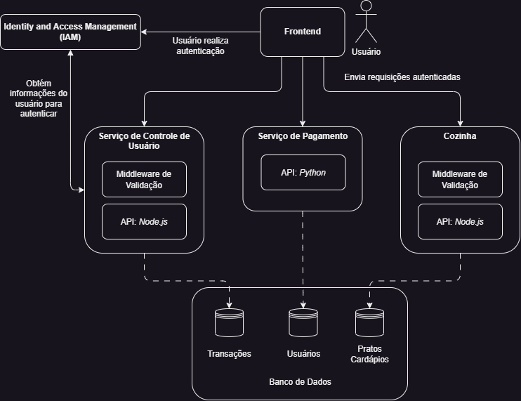
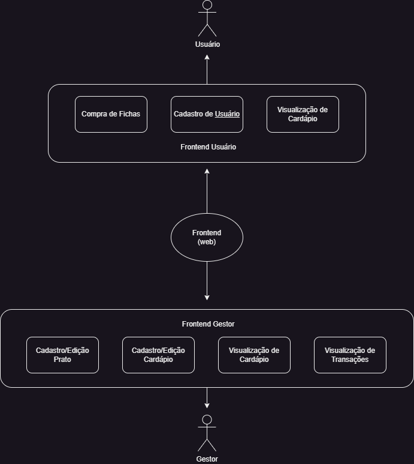

# RU - UFRPE 

Este projeto foi desenvolvido para a disciplina de Sistemas Distribuídos da Universidade Federal Rural de Pernambuco. O objetivo é criar um sistema para compra de fichas de refeição do restaurante da universidade, utilizando tecnologias modernas de desenvolvimento e arquiteturas distribuídas.

O sistema foi dividido em 4 módulos distintos: 
- Frontend (web)
- Serviço de Controle de Usuário
- API para pratos/refeições 
- Processamento de pagamentos.

## Módulos

### [Frontend (web)](web)

Módulo responsável pela interface do usuário e do gestor.

**Telas:**
- [x] Cardápio do dia
- [x] Login/Cadastro
- [x] Compra de fichas
- [x] Finalizar compra
- [x] Cadastrar pratos
- [x] Cadastrar cardápios
- [x] Listar pratos
- [x] Listar cardápios
- [x] Listar transferências (gestor) 

Tecnologias utilizadas:
- NodeJS
- Axios
- ReactJS
- Chakra UI

### [Serviço de usuário (user)](user)

Módulo responsável pela cadastro de usuários, login, autenticação, contagem de fichas por usuário.

**Funcionalidades:**
- [x] Cadastro de novos usuários
- [x] Usuário com permissões de ADM
- [x] Token de acesso 

**Tecnologias utilizadas:**
- NodeJS
- Express
- JWT
- MongoDB

### [Gerenciamento de Pratos/Cardápios (cozinha) ](cozinha)

**Funcionalidades:**

- [x] Fornece o cardápio do dia para os usuários
- [x] Cadastra novos pratos (pelo gestor)
- [x] Cadastra novos cardápios (pelo gestor)
- [x] Edita pratos 
- [x] Edita cardápios

**Tecnologias utilizadas:**
- NodeJS
- Express
- JWT
- MongoDB
  
### [Serviço de Pagamento](payment)

Feito em Python 3.10, é responsável por processar pagamentos feitos por cartão de crédito e PIX.

**Funcionalidades:**

- [x] Verifica validez do número do cartão
- [x] Verifica data de vencimento
- [x] Valida CPF para o PIX
- [x] Retorna uma lista das transações feitas 

**Tecnologias utilizadas:**
- Flask
- PyMongo

## Desenvolvedores

<table>
  
  <tr>
    <td align="center"><a href="https://github.com/luanaccioly"> <b>Luan Accioly</b></a> </td>
    <td align="center"><a href="https://github.com/marioleandro"> <b>Mario Leandro</b></a> </td>
  </tr>
</table>